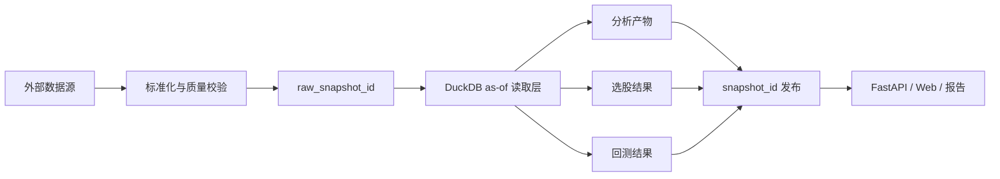

# QuantA Architecture Map

## Goal

QuantA 的首要目标不是一次性做成“大而全量化平台”，而是建立一套对智能体和人类都清晰的可演进结构，让我们先把 `日线数据 -> 盘后分析 -> 选股 -> 回测 -> 展示` 的闭环跑通。

## Architecture Shape

系统按三层来理解：

1. `repo harness`
   由 `AGENTS.md`、`docs/`、执行计划、校验脚本组成，负责让智能体知道“项目是什么、规则是什么、下一步去哪里看”。
2. `application architecture`
   由数据采集、标准化、存储、分析、选股、回测、API、前端组成，负责业务实现。
3. `runtime harness`
   未来如果要把智能体嵌入产品或后台任务，再引入线程、回合、审批、事件流等运行时能力。

当前仓库优先建设前两层。

## Planned Code Layout

```text
backend/
  app/
    domains/
      market_data/
      analysis/
      screener/
      backtest/
      tasking/
    shared/
      providers/
      telemetry/
      utils/
    app_wiring/
    api/

frontend/
  src/
    app/
    pages/
    features/
      market-overview/
      stock-detail/
      screener-results/
      backtest-report/
    shared/
```

## Domain Layering

后端默认采用固定依赖方向，减少架构漂移：

```text
Types -> Config -> Repo -> Service -> Runtime/API
                 ^
                 |
             Providers
```

约束：

1. `Types`
   领域对象、请求参数、枚举、口径定义。
2. `Config`
   领域配置、默认值、策略参数定义。
3. `Repo`
   DuckDB 读取、写入、as-of 查询封装。
4. `Service`
   业务编排，例如分析计算、选股评分、回测回放。
5. `Runtime/API`
   任务入口、FastAPI、CLI、调度器。
6. `Providers`
   连接外部世界的显式入口，例如 AKShare、腾讯行情、通知、日志、遥测。

## Formal Source Strategy

为了把 QuantA 的 v1.0 做成“可交付、可复现、可运维”的盘后研究系统，正式数据源按 `canonical -> official disclosure -> supplementary -> future licensed realtime` 四层管理：

1. `Canonical structured source`
   盘后结构化主数据、交易日历、日线、复权因子、每日指标、涨跌停价、停复牌、龙虎榜、资金流等核心表，优先使用有明确账号体系、文档和调用门槛的结构化服务，当前默认收敛到 `Tushare Pro`。
2. `Official disclosure source`
   公告、公开信息、披露日历、问询与交易所公开信息，优先使用法定或官方平台，例如 `巨潮资讯`、`上交所`、`深交所`。
3. `Supplementary adapter source`
   `AKShare` 继续保留为正式支持的数据采集适配器之一，但在 v1.0 中主要承担补充、验证、缺口兜底和快速探索职责，而不是单独作为核心持久化表的唯一 canonical source。
4. `Future licensed realtime source`
   分钟级、实时快照、Level-1/Level-2 和更严格授权场景，后续再接入有明确许可和收费标准的商业服务，例如交易所行情授权或 Choice 量化接口。

当前明确排除项：

1. 不把无公开文档、无稳定授权边界的网页内部接口直接当作核心持久化表的 canonical source。
2. 不让 query/read path 直接依赖随时可能被风控或封控的隐藏上游接口。
3. 不把盘中试验性行情源直接混入盘后回测和 READY snapshot 发布链。

## Core Data Flow



## Non-Negotiable Invariants

1. 所有外部数据都要经过边界标准化。
2. 原始数据快照和发布快照分离。
3. 查询侧默认只读 `READY` 的 `snapshot_id`。
4. 回测记录同时绑定 `raw_snapshot_id` 和 `snapshot_id`。
5. 任务链路必须可重跑、可追踪、可解释。
6. 能写成规则的约束，尽量不要只写成口头偏好。
7. 每类核心数据集必须有单一 `canonical source`，允许补充源，但不能在发布时混淆主责来源。

## Source Documents

当前业务设计以这些文档为准：

1. [A股分析系统需求路线图](/Users/carpon/web/QuantA/mydoc/A股分析系统需求路线图.md)
2. [A股分析系统架构设计](/Users/carpon/web/QuantA/mydoc/A股分析系统架构设计.md)
3. [A股分析系统实施文档](/Users/carpon/web/QuantA/mydoc/A股分析系统实施文档.md)

面向智能体的摘要、计划和约束则沉淀到 `docs/`。
